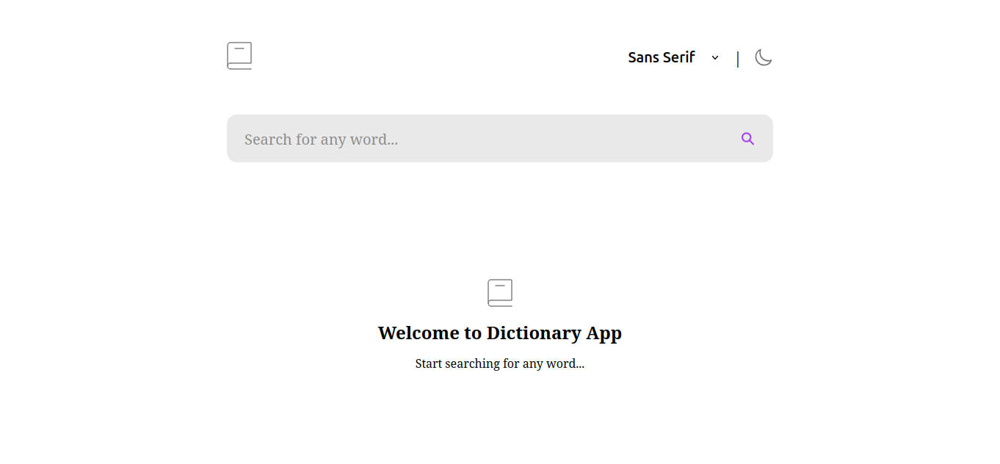
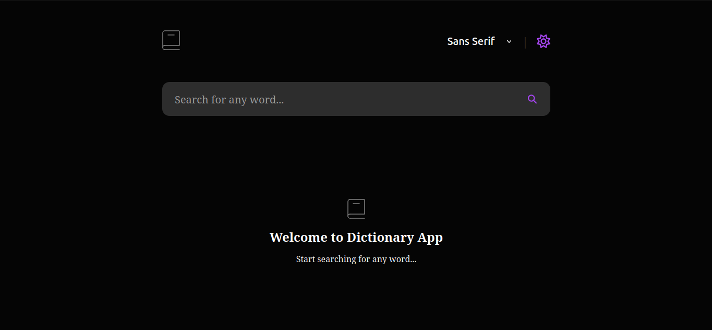
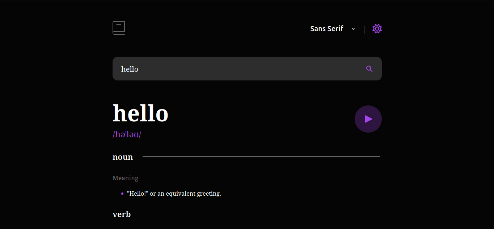
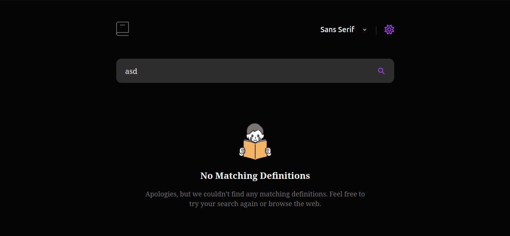
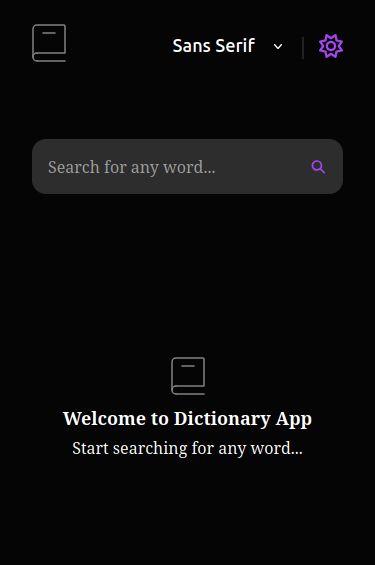
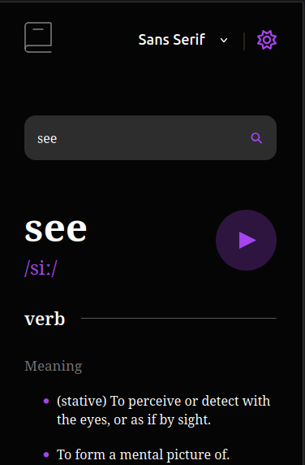

# 📖 Dictionary Web App

A **simple and responsive dictionary web application** built with **React JS**.  
Search for words and get definitions, phonetics, pronunciation, synonyms, and antonyms in a clean interface.

---

## 🛠️ Technologies

  
  
  
  

---

## ✨ Features

- Search for any word  
- View **definitions**, **parts of speech**, **synonyms**, and **antonyms**  
- Pronunciation with audio  
- **Dark & Light Mode** toggle  
- Font style switcher  
- Loading indicator  
- Error handling for invalid words  
- Fully responsive design for desktop & mobile  

---

## 📸 Screenshots

**Desktop View**  

- **Light Mode**  
  

- **Dark Mode**  
  

- **Search Result**  
  

- **Error / Word Handling**  
  

**Mobile View**  

- **Mobile Home**  
  

- **Mobile Search Result**  
  

---

## 💡 Learning Outcomes

- Fetching and handling API data in React  
- State management with React Hooks  
- Conditional rendering  
- Theme switching implementation  
- API error handling  
- Responsive UI design  

---

## 🔗 Useful Resources

- [React Documentation](https://react.dev/)  
- [Free Dictionary API](https://dictionaryapi.dev/)  
- [Frontend Mentor](https://www.frontendmentor.io/)  

---

**Made by Chitra Shrestha**
