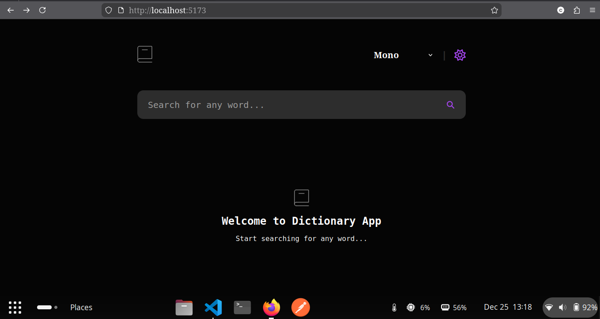
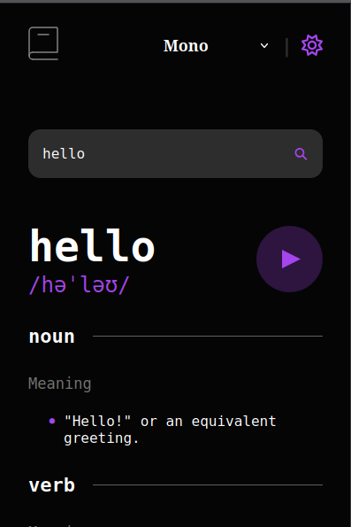

# Dictionary Web App

A simple web application that allows users to search to search word and it show word definition, phonetic, meaning, part of speech, antonym, synonym, source.

## Features
- Dark and light mode
- Font switcher (monospace, serif, sans-serif)
- Search for word meanings
- Pronunciation of words
- Display synonyms and antonyms
- Shows "Whoops, can’t be empty..." if the search box is empty
- Shows "Loading..." while searching for a word
- Shows a "Not Found" message when no matching word is found
- Mobile responsive design (works on phones and tablets)

## Screenshots

## Technologies Used
- HTML
- CSS
- JavaScript
- React JS
- React Icons
- Dictionary API ([Free Dictionary API](https://dictionaryapi.dev/))

## License
This project is part of a [Frontend Mentor](https://www.frontendmentor.io/) challenge.

**Made by Chitra Shrestha**
